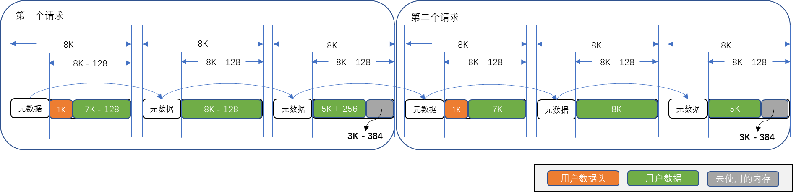

# UMQ Buffer

## 功能简介
UMQ Buffer作为UMQ组件提供的数据面内存池，结合单向链表、TLS等特性为端到端传输提供了高性能内存池管理能力。

UMQ Buffer使用时主要涉及两个内存实体概念

* 消息元数据（message metadata），对应`umq_buf_t`或`struct umq_buf`结构体，其主要作用是记录对应的消息载荷（message payload）的相关配置信息。
* 消息载荷（message payload），对应实际用户用于存储数据的内存。

## 消息元数据
消息元数据的定义可以参考[umq_types.h](https://gitee.com/openeuler/umdk/blob/master/src/urpc/include/umq/umq_types.h)，其中主要涉及以下字段：

* `qbuf_next`：指明下一片Buffer对应的消息元数据的地址，此字段可以将UMQ Buffer串接成链表，方便批量操作。
* `umqh`：指明当前内存是否属于某一个umq，部分场景将会使用非全局内存池（如共享内存场景），此时申请的内存属于某一umq。
* `total_data_size`：总数据长度，此长度可以跨多片内存，例如用户申请了3片8K长度的内存并且串接成一条链，则此时`total_data_size`为24K。复杂示例可以参考后面接口功能介绍章节中的示例说明。
* `buf_size`：消息元数据+对应的消息载荷长度。
* `data_size`：消息载荷内的数据长度。
* `headroom_size`：消息载荷内的用户定义数据头的长度。
* `first_fragment`：当一个请求内存在多个消息串联时，此字段标记是否是首个消息，期内会记录当前请求的一些配置信息。
* `token_id`：UMQ内部使用的token id。
* `mempool_id`：指明当前内存属于哪一个内存池。
* `token_value`: UMQ内部使用的token value。
* `status`: 当消息元数据被用户使用于数据面之后，如果出现异常则会将异常的Buffer返回给用户，并且将异常对应的错误码置于`status`字段以告知用户具体错误。
* `io_direction`：用于指明当前Buffer将用于什么IO方向，如发送方向（TX）或者接收方向（RX）等。
* `need_import`：UMQ内部标记，主要用于扩容时注册内存逻辑的快速触发，用户正常使用时无需感知此字段。
* `buf_data`：指向实际消息载荷的地址。
* `qbuf_ext`：扩展数据，对应`umq_buf_pro_t`或者`struct umq_buf_pro`定义。主要是用于内存在数据面接口使用时的参数配置，定义可以参考[umq_pro_types.h](https://gitee.com/openeuler/umdk/blob/master/src/urpc/include/umq/umq_pro_types.h)。
* `data`：combine模式的消息载荷起始地址，因为combine模式下数据头和消息载荷是连续的内存。

## 消息载荷
消息载荷是用户实际用于数据存储的内存，用户的完整数据可能会跨越多个消息载荷而存在。如果将所有的消息载荷连接在一起，逻辑上而言，用户的数据主要被划分为三个逻辑部分：

* 用户数据头，对应`headroom`。
* 用户数据，对应`data`。
* 未使用的内存，即多余的内存。

那么对于每一片独立的内存（消息元数据+消息载荷）而言，`headroom_size`就表示当前消息载荷中的用户数据头的长度，`data_size`则表示当前消息载荷中的用户数据长度。其中存以下隐性约束和规则：

* 消息载荷中如果存在用户数据头，则默认认为用户数据头存在于用户数据之前。

## 模式概述
UMQ Buffer当前支持两种模式：

* split模式，对应`UMQ_BUF_SPLIT`类型。使用split模式时，消息元数据和消息载荷不是连续的内存。
* combine模式，对应`UMQ_BUF_COMBINE`类型。使用combine模式时，消息元数据和消息载荷是连续的内存。

### split模式

split模式的数据头与消息载荷的内存布局可以参见下图。数据头与消息载荷在内存上并不是处于连续的内存之上，因此split模式的直接访问`data`字段是非法的，要获取实际消息载荷的地址需要访问`buf_data`字段。需要注意的是split模式的消息载荷是大页内存（4KB）整数倍。如果用户场景需要使用完整大页内存时（即4KB整倍数的内存时），可以选择使用split模式。

### combine模式

combine模式的数据头与消息载荷的内存布局可以参见下图。其数据头与消息载荷在内存上是处于连续的状态，因此combine模式获取实际消息载荷的地址可以使用`data`或者`buf_data`字段，两者都是合法字段。但是combine模式为了达到更高的性能，往往会将每一组数据头与消息载荷限制在独立的大页内存内，换句话说，数据头+消息载荷的总长度是大页内存（4KB）整数倍。这就导致了combine模式的消息载荷的长度略小于大页内存（4KB）的整数倍。如果用户场景对此限制敏感，可以选择使用split模式。

## 接口功能介绍

UMQ Buffer相关的接口定义可以参见[umq_api.h](https://gitee.com/openeuler/umdk/blob/master/src/urpc/include/umq/umq_api.h)，UMQ Buffer的申请释放接口为了提供高性能的内存申请释放能力，接口层面提供了强大的batch操作的能力。

### 申请内存

`umq_buf_alloc`申请接口主要涉及以下几个参数：

* `request_size`：单次请求需要的内存长度。
* `request_qbuf_num`：请求的个数。
* `umqh`：是否从umq中申请。
* `option`：申请接口的扩展参数配置

以下将针对split模式与combine模式分别举例说明：我们尝试为2个请求申请1K的用户数据头（通过`option.headroom_size`进行配置）以及20K的用户数据(通过`request_size`进行配置)。下述示例中数据头的长度默认为128B,即`umq_buf_t`结构体长度，示例中不再赘述解释。

#### split模式示例

> **注意**
> * 每个请求的首片数据头内会记录整个请求相关的配置，如`total_data_size`、`qbuf_ext`等等，这些字段在非首片内是无效字段，用户不应该信任这些字段的内容。
> * 当前示例使用典型内存块大小（8K）进行阐述。

第一个请求的第一片内存：

* `total_data_size`：作为请求内首片内存的数据头内会记录请求的数据大小为20KB。
* `buf_size`：128B（`sizeof(umq_buf_t)`）+ 8K
* `data_size`：7K，注意此处长度不包含用户数据头。
* `headroom_size`：1K

第一个请求的第二片内存：

* `buf_size`：128B（`sizeof(umq_buf_t)`）+ 8K
* `data_size`：8K

第一个请求的第三片内存：

* `buf_size`：128B（`sizeof(umq_buf_t)`）+ 8K
* `data_size`：5K

第二个请求同理，此处不过多赘述。

#### combine模式示例

> **注意**
> * 每个请求的首片数据头内会记录整个请求相关的配置，如`total_data_size`、`qbuf_ext`等等，这些字段在非首片内是无效字段，用户不应该信任这些字段的内容。
> * 当前示例使用典型内存块大小（8K）进行阐述。

第一个请求的第一片内存：

* `total_data_size`：作为请求内首片内存的数据头内会记录请求的数据大小为20KB。
* `buf_size`：8K
* `data_size`：7K - 128，注意此处长度不包含用户数据头。
* `headroom_size`：1K

第一个请求的第二片内存：

* `buf_size`：8K
* `data_size`：8K - 128

第一个请求的第三片内存：

* `buf_size`：8K
* `data_size`：5K + 256

第二个请求同理，此处不过多赘述。