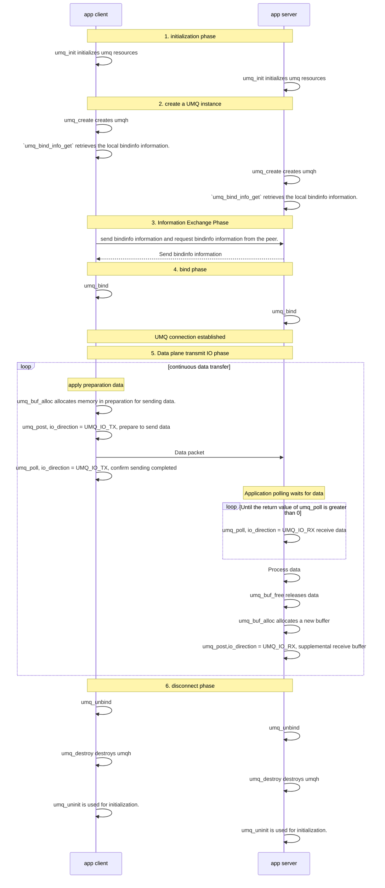

# UMQ IO

## 功能简介
UMQ IO 是 UMQ 组件体系中的数据面IO处理引擎，专门负责高效、异步的数据面IO操作管理. 它提供了umq_post/umq_poll接口进行IO处理

**概述**:
    (1) post/poll方式更灵活，用户可以通过poll tx感知到post tx的完成事件，同时需要用户调用post rx 补充接收数据的buffer

**应用场景**：
    post/poll处理IO

**使用说明**：

