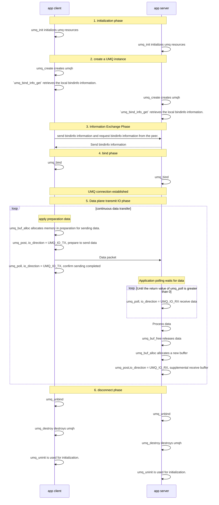

# UMQ IO

## Function Introduction
UMQ IO is the data plane I/O processing engine in the UMQ component system, specifically responsible for efficient, asynchronous data plane I/O operation management. It provides the umq_post/umq_poll interfaces for I/O processing.

**Overview**:
    (1) the post/poll method is more flexible. Users can detect the completion event of post tx through poll tx, and at the same time, users need to call post rx to replenish the buffer for receiving data.

**Application Scenarios**:
    post/poll handles I/O.

**Instructions for Use**:
